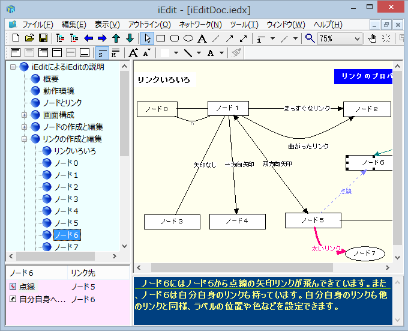

# イントロダクション

## アイデアプロセッサー iEdit

iEdit は、アウトラインプロセッサーとダイアグラムエディターを統合したアイデアプロセッサーです。

iEdit では、ラベルとテキストからなる「ノード」をアイデアを構成する１つの単位とします。ツリーによる階層構造とネットワークビュー上のダイアグラムの組み合わせでアイデアを練り上げていきます。

ノードとノードの関連をリンクと呼びます。リンクはネットワークビューのダイアグラムでは線と矢印で表現されます。また、リンク先はノードに限らず、ディスク上のファイルやWebのURLなども指定できます。

文書の構成を考える、フロー図を書く、日々の仕事を整理するなど用途はさまざまです。

## iEdit の動作環境
iEdit は Windows 10 で動作します。

## 開発環境

iEdit は Microsoft Visual C++ 14.1 (2017) でビルドしました。
